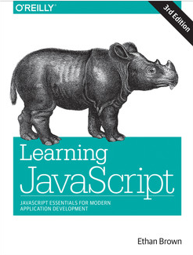
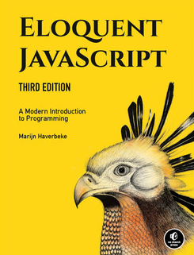
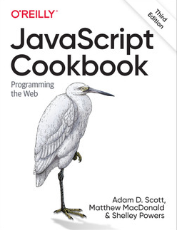
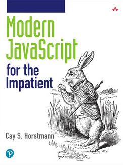

# Développement côté client avec Javascript (2ème année)

Ce dépôt contient les sources du module *Développement Front-End* (côté client), 2ème année (B2). Vous y retrouverez les démos réalisées en cours, les exercices et leurs corrections.

- [Développement côté client avec Javascript (2ème année)](#développement-côté-client-avec-javascript-2ème-année)
  - [Démos](#démos)
  - [Exercices et corrections](#exercices-et-corrections)
  - [Références](#références)
    - [Documentation](#documentation)
    - [Livres](#livres)
    - [Sur le web](#sur-le-web)
    - [Conférences/Vidéos Sur YouTube](#conférencesvidéos-sur-youtube)
    - [Bibliothèques](#bibliothèques)
    - [Quelques API web](#quelques-api-web)
    - [Standards](#standards)

## Démos

> À venir

## Exercices et corrections

> À venir

## Références

- [Développement côté client (1ère année)](https://github.com/paul-schuhm/developpement-cote-client-js), le dépôt du cours de 1ère année;

### Documentation

- [MDN : Resources for Developers, by Developers](https://developer.mozilla.org/fr/), la documentation unifiée des technologies du web
- [JavaScript (MDN)](https://developer.mozilla.org/fr/docs/Web/JavaScript), le point d'entrée de la MDN pour apprendre JS. Guides, Tutoriels par niveau, Références

### Livres

> En prendre un

- [Modern JavaScript for the Impatient](https://www.oreilly.com/library/view/modern-javascript-for/9780136502166/), de Cay S. Horstmann, Addison-Wesley Professional, 2020. **LI+** ;
- [JavaScript Cookbook: Programming the web (3rd edition)](https://www.oreilly.com/library/view/javascript-cookbook-3rd/9781492055747/), de Scott, MacDonald et Powers, 0'Reilly, 2021. **LP+** ;
- [Simplifying JavaScript : Writing Modern JavaScript with ES5, ES6 and Beyond](https://pragprog.com/titles/es6tips/simplifying-javascript/), de Joe Morgan, The Pragmatic Bookshelf, 2018. **LP+** ;
- [Learning JavaScript, 3rd Edition](https://www.oreilly.com/library/view/learning-javascript-3rd/9781491914892/), de Ethan Brown, O'Reilly, 2016. **LE+**
- [Eloquent JavaScript, 3rd Edition](https://www.oreilly.com/library/view/eloquent-javascript-3rd/9781492071198/), de Marijn Haverbeke, No Starch Press, 2018. **LE+**
- [JavaScript: The Definitive Guide: Master the World's Most-Used Programming Language](), **LE++**. Une fois qu'on connaît bien JS, s'en servir comme référence. Parle de JS dans le browser, Node.js.

### Sur le web

- [JavaScript Visualizer 9000](https://www.jsv9000.app/), site web qui permet de visualiser l'environnement d'exécution de JavaScript. Inspiré par [Loupe](http://latentflip.com/loupe/), de Philip Roberts. 

### Conférences/Vidéos Sur YouTube

<!-- 
Senior JS Developer
 -->
- [Wat](https://www.destroyallsoftware.com/talks/wat), de Gary Bernhardt, CodeMash 2012. Sur les zones d'ombre des langages *faiblement typés*, dont JS. Avec **humour** ; 
- [JavaScript Objects and Prototypes In-depth](https://youtube.com/playlist?list=PLqq-6Pq4lTTaflXUL0v3TSm86nodn0c_u), excellente série de vidéos détaillées pour bien comprendre les specs de JS et son approche orientée prototype ;
- [What the heck is the event-loop anyway ?](https://www.youtube.com/watch?v=8aGhZQkoFbQ), de Philip Roberts. Pour comprendre l'environnement d'exécution de JavaScript. *Classic* ;
- [JSConf](https://www.youtube.com/@jsconf_), la chaîne YouTube de [JSConf](https://jsconf.com/). Des tonnes de conférences pour approfondir ses connaissances en JavaScript et réfléchir à des choses ;

### Bibliothèques

- [jQuery](https://jquery.com/)
- [Leaflet](https://leafletjs.com/)
- [Lodash](https://lodash.com/)
- [p5js](https://p5js.org/)

### Quelques API web

[Voir la liste complète](https://developer.mozilla.org/fr/docs/Web/API).

- [DOM](https://developer.mozilla.org/fr/docs/Web/API/Document_Object_Model) ;
- [Fetch](https://developer.mozilla.org/fr/docs/Web/API/Fetch_API) ;
- [Keyboard API](https://developer.mozilla.org/en-US/docs/Web/API/Keyboard_API)

### Standards

- [ECMA-262](https://ecma-international.org/publications-and-standards/standards/ecma-262/), le standard ECMAScript (dernière version) ;
- [RFC 8259 : The JavaScript Object Notation (JSON) Data Interchange Format](https://datatracker.ietf.org/doc/html/rfc8259) ;
